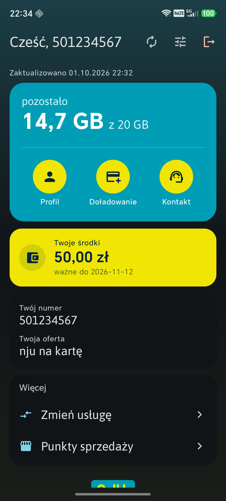
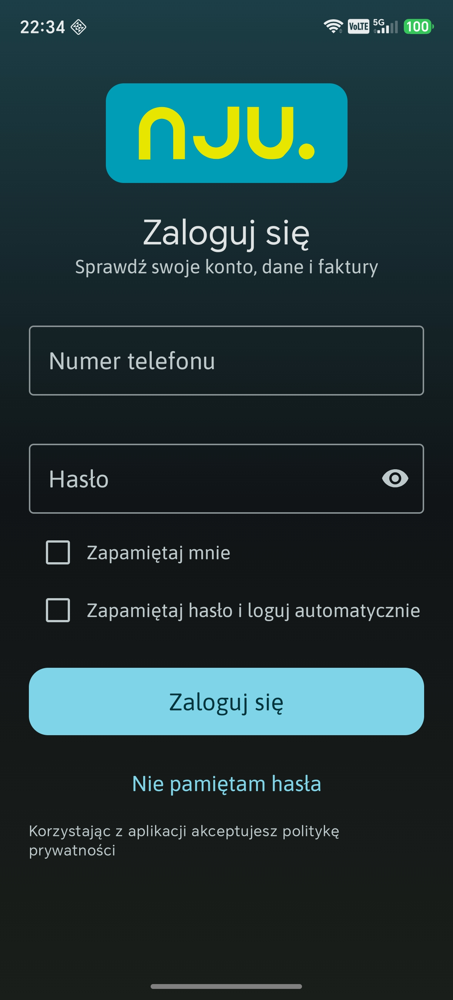
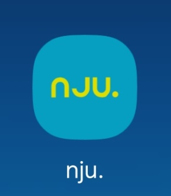

# nju.

An unofficial Android app for checking an **njumobile.pl** account — balance,
data allowance, offer — without opening a browser.

> **Unofficial.** Not affiliated with, endorsed by, or connected to nju or
> Orange Polska. The nju name, wordmark and colours are their trademarks and
> are used here only to identify the service this app talks to. No licence to
> those marks is granted by this repository; the *code* is GPL-3.0 (see
> [LICENSE](LICENSE)).

## Screenshots

| Dashboard | Login | Launcher icon |
| --- | --- | --- |
|  |  |  |

## What it does

- **Native Jetpack Compose UI** — Material 3, follows the system theme, with a
  subtle nju-coloured gradient wash behind the top bar.
- **Stale-while-revalidate cache** — the dashboard paints instantly from the
  last snapshot instead of showing spinners on every launch.
- **Silent re-login** — njumobile.pl times its session out on inactivity rather
  than losing the cookie, so the app keeps the session alive on a timer and, if
  it expires anyway, re-posts stored credentials instead of bouncing you to the
  login form. A banner shows `Ponowne logowanie…` while that happens.
- **Deep links into the account area** — Profil, Doładowanie, Kontakt, Usługi,
  Punkty sprzedaży all open in a chrome-less webview with a branded loading
  page.
- **Customisable greeting** — `Cześć, <numer>` by default, or set your own name.
- **Launcher icon** derived from the nju wordmark vector, plus a monochrome
  layer for Android 13+ themed icons.

## Building

Requires JDK 17+ and an Android SDK (compileSdk 34, minSdk 26).

```bash
./gradlew installProdDebug     # side-load a debug build
./gradlew assembleProdRelease
```

### A note on the `demo` flavour

The source also carries a `demo` build — `pl.nju.opencode.demo`,
`versionName 1.0-demo` — used **internally only**, for development testing and
for taking the screenshots above. It never contacts njumobile.pl: it boots
with a fixed fake account from `ui/DemoAccount.kt` and short-circuits both the
refresher and the session keep-alive, so no packet leaves the device.

**`pl.nju.opencode` is the app.** The demo build is not published, not
released, and is not meant to be installed by anyone else.

### Signing

`assembleProdRelease` looks for a signing config in `keystore.properties` at
the repo root, then in `~/.config/nju-mobile/signing.properties`:

```properties
storeFile=/absolute/path/to/release.jks
storePassword=...
keyAlias=...
keyPassword=...
```

Neither file ships with the repository — they live outside it on purpose, so
no keystores can leak into a commit or an upload. **Without one the release
build still succeeds, it just emits `app-prod-release-unsigned.apk`, which
Android will not install.**

Note that swapping an installed build for one signed by a different key
requires an uninstall first, which clears the app data — including the
encrypted saved password.

## How the scraping works

Login is detected by URL (`mojekonto` present, `logowanie` excluded), then a
native Compose form drives an invisible `WebView`. Field extraction uses exact
DOM selectors rather than regex, and every result is ranked by `completeness`
before it replaces the cache — the account page paints in stages, so a single
scrape is usually partial, and ranking is what stops a half-loaded snapshot
from blanking a field that was already correct.

## Security notes — read these

- Your password is stored **AES-256-GCM encrypted under an Android Keystore
  key** (`nju_password_key`). The key is non-exportable and lives in hardware
  on devices that support it.
- **The honest ceiling:** anything that can ask *your* Keystore to decrypt
  can read it back. A rooted device, or an attacker with your unlocked phone,
  defeats this. It protects against the credential sitting in plaintext in the
  app's shared preferences — it is not a defence against full device
  compromise.
- Auto-login is **opt-in**: you must tick *Zapamiętaj hasło i loguj
  automatycznie* on a manual login. Explicit logout clears the stored
  credentials.
- The app holds an authenticated web session. Treat a device with this app
  logged in as you would the site itself.

## Made with AI

This application was written by an AI coding agent (OpenCode). That is why the
package is `pl.nju.opencode` — no intention to pretend otherwise.

## Licence

Code: [GNU GPL v3](LICENSE).

The nju wordmark, brand colours and the name "nju" are the property of their
owners and are **not** covered by that licence.
